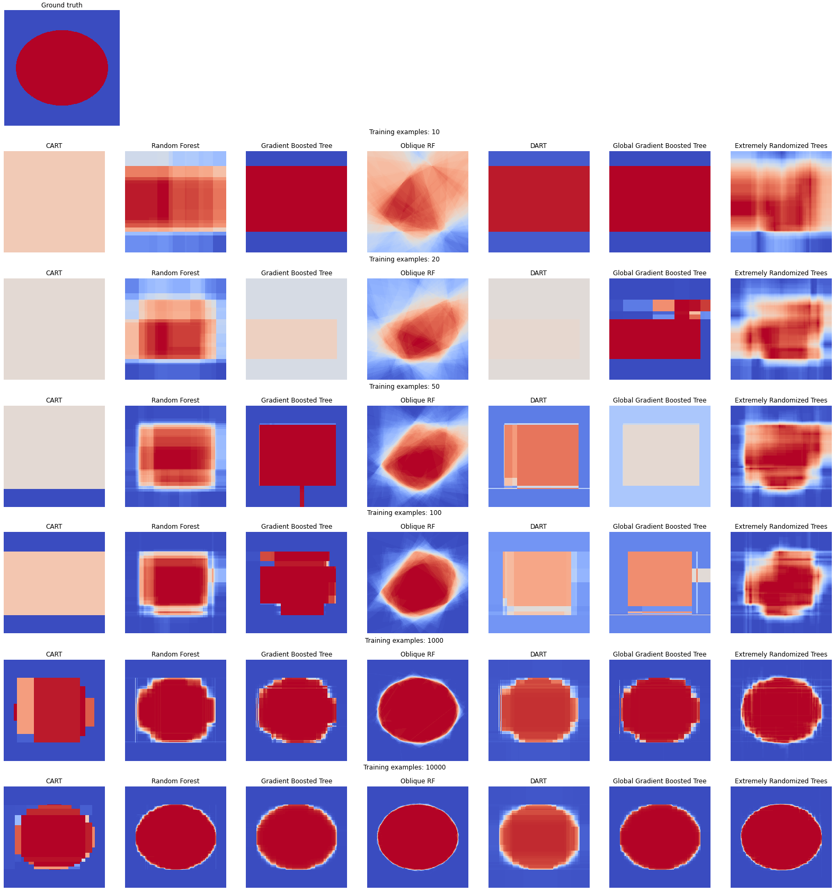

# Learn 2d ellipses patterns with different flavors of Decision Forests

Trains and plots models with different decision forest learning algorithms (Cart, Random Forest, Oblique Random Forests,  Gradient Boosted Trees, Gradient Boosted Trees with Global optimization, Dart, Extremly Randomized Trees) on a 2d ellipse pattern and with various amount of training data (from 10 to 10k examples). Models are trained with [TensorFlow Decision Forests](https://github.com/tensorflow/decision-forests). The code is available in [this Colab](notebook.ipynb).

